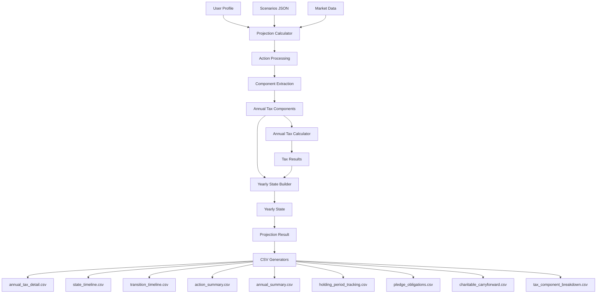

# CSV Generation Architecture

## Overview

The CSV generation system transforms complex financial projections into human-readable reports for analysis and decision-making. This document defines the optimal architecture for reliable, maintainable, and testable CSV generation.

## Design Principles

1. **Single Source of Truth**: Each piece of data has one authoritative source
2. **Explicit Data Flow**: Data transformations are clear and traceable
3. **Separation of Concerns**: Calculation, aggregation, and formatting are separate
4. **Testability**: Each component can be tested in isolation
5. **No External Dependencies**: CSVs are for human analysis only
6. **Progressive Disclosure**: Summary → Annual → Detailed views

## Architecture Layers

### 1. Data Sources
```
User Profile (JSON)
    ↓
Projection Calculator
    ↓
Annual Tax Components (per year)
    ↓
Yearly State (aggregated)
    ↓
Projection Result (complete)
```

### 2. Data Flow



## Data Model

### Core Data Structures

#### 1. AnnualTaxComponents
- **Purpose**: Aggregate all tax-relevant events for a year
- **Contains**: 
  - ISO/NSO exercise components
  - Sale components (STCG, LTCG, ordinary income)
  - Donation components
  - Income components (W2, spouse, other)
- **Attached to**: YearlyState

#### 2. YearlyState
- **Purpose**: Complete financial snapshot for a year
- **Must Include**:
  ```python
  class YearlyState:
      year: int
      
      # Income tracking
      income: float  # W2 income
      spouse_income: float
      other_income: float
      
      # Cash flow
      starting_cash: float
      exercise_costs: float
      tax_paid: float
      donation_value: float
      ending_cash: float
      
      # Tax state
      tax_state: TaxState
      
      # Charitable state
      charitable_state: CharitableDeductionState
      
      # Equity tracking
      equity_holdings: List[ShareLot]
      
      # Disposal tracking
      shares_sold: Dict[str, int]
      shares_donated: Dict[str, int]
      
      # Component data for CSV generation
      annual_tax_components: AnnualTaxComponents
  ```

#### 3. ShareLot Lifecycle Tracking
```
GRANTED_NOT_VESTED → VESTED_NOT_EXERCISED → EXERCISED_NOT_DISPOSED → DISPOSED
                 ↓                      ↓                         ↓
              EXPIRED               EXPIRED                  (SOLD/DONATED)
```

## CSV File Specifications

### 1. annual_tax_detail.csv
**Purpose**: Complete tax breakdown by component  
**Source**: YearlyState.annual_tax_components  
**Key Logic**:
```python
# Extract from annual_tax_components
nso_ordinary = sum(e.bargain_element for e in components.nso_exercise_components)
nso_ordinary += sum(s.ordinary_income for s in components.sale_components)
stcg = sum(s.short_term_gain for s in components.sale_components)
ltcg = sum(s.long_term_gain for s in components.sale_components)
iso_bargain = sum(e.bargain_element for e in components.iso_exercise_components)
```

### 2. state_timeline.csv
**Purpose**: Track share quantities in each lifecycle state  
**Features**:
- Rename VESTED_ISO → ISO, VESTED_NSO → NSO
- Group related lots (ISO + ISO_EX_*)
- Show SUBTOTAL for exercised lots
- Show TOTAL for lot groups
**Key Logic**:
```python
# Detect granted shares
if lot.lifecycle_state == LifecycleState.GRANTED_NOT_VESTED:
    granted_quantity = lot.quantity

# Handle automatic vesting
if 'VEST_' in lot_id and date_from_lot_id <= current_year_end:
    transition_to_vested()
```

### 3. transition_timeline.csv
**Purpose**: Show movement between lifecycle states  
**Must Track**:
- Granting: New shares granted
- Vesting: GRANTED → VESTED (including automatic date-based)
- Exercising: VESTED → EXERCISED
- Selling/Donating: Disposal events
- Expiring: Options that expire unexercised
**Key Logic**:
```python
# Automatic vesting detection
if 'VEST_' in lot_id:
    vest_date = parse_date_from_lot_id(lot_id)
    if vest_date.year == current_year:
        vesting_quantity = lot.quantity
```

### 4. action_summary.csv
**Purpose**: Detailed record of every user action  
**Enhanced Fields**:
- acquisition_date
- holding_period_days
- tax_treatment
- amt_adjustment
- pledge_created (calculated correctly)
- vest_expiration_date

### 5. annual_summary.csv
**Purpose**: Year-by-year financial summary  
**Must Include**:
- exercise_costs (from YearlyState.exercise_costs)
- All donation values
- Company match amounts
- Correct tax totals

### 6. holding_period_tracking.csv
**Purpose**: Track tax treatment eligibility  
**Key Features**:
- ISO qualifying disposition dates
- Days until qualifying
- Current holding status

### 7. pledge_obligations.csv
**Purpose**: Track donation commitments from sales  
**Calculation**:
```python
# Maximalist interpretation formula
shares_required = (pledge_percentage * shares_sold) / (1 - pledge_percentage)
obligation_amount = shares_required * current_price
```

### 8. charitable_carryforward.csv
**Purpose**: Track unused charitable deductions  
**Data Sources**:
- Donations: YearlyState.annual_tax_components.donation_components
- Deductions used: YearlyState.charitable_state.current_year_deduction
- AGI calculation: Include all income sources + capital gains

### 9. tax_component_breakdown.csv
**Purpose**: Show tax by income type and lot  
**Categories**:
- W2_income
- ISO_exercise (AMT adjustments)
- NSO_exercise (ordinary income)
- STCG/LTCG by lot
- Charitable deductions

## Implementation Requirements

### 1. Automatic Vesting Detection
```python
class VestingDetector:
    @staticmethod
    def process_automatic_vesting(lots: List[ShareLot], current_date: date) -> List[VestingEvent]:
        """Detect and process lots that should vest based on embedded dates."""
        vesting_events = []
        for lot in lots:
            if lot.lifecycle_state == LifecycleState.GRANTED_NOT_VESTED:
                vest_date = VestingDetector.extract_vest_date(lot.lot_id)
                if vest_date and vest_date <= current_date:
                    vesting_events.append(VestingEvent(lot, vest_date))
        return vesting_events
    
    @staticmethod
    def extract_vest_date(lot_id: str) -> Optional[date]:
        """Extract vesting date from lot_id like VEST_20250524_ISO."""
        if 'VEST_' in lot_id:
            try:
                date_str = lot_id.split('_')[1]
                return date(int(date_str[:4]), int(date_str[4:6]), int(date_str[6:8]))
            except:
                return None
        return None
```

### 2. Expiration Detection
```python
class ExpirationDetector:
    @staticmethod
    def detect_expirations(lots: List[ShareLot], current_date: date, 
                          option_term_years: int = 10) -> List[ExpirationEvent]:
        """Detect options that have expired."""
        expirations = []
        for lot in lots:
            if lot.lifecycle_state == LifecycleState.VESTED_NOT_EXERCISED:
                expiration_date = lot.grant_date + timedelta(days=option_term_years * 365)
                if expiration_date <= current_date:
                    expirations.append(ExpirationEvent(lot, expiration_date))
        return expirations
```

### 3. Data Attachment Pattern
```python
class ProjectionCalculator:
    def evaluate_projection_plan(self, plan: ProjectionPlan) -> ProjectionResult:
        # ... existing code ...
        
        # CRITICAL: Attach components to YearlyState
        yearly_state.annual_tax_components = annual_components
        yearly_state.spouse_income = self.profile.spouse_w2_income
        yearly_state.other_income = self.profile.other_income
        
        # Process automatic events
        vesting_events = VestingDetector.process_automatic_vesting(
            current_lots, date(year, 12, 31))
        expiration_events = ExpirationDetector.detect_expirations(
            current_lots, date(year, 12, 31))
        
        # Apply state changes
        for event in vesting_events:
            self._apply_vesting(event, current_lots, annual_components)
        for event in expiration_events:
            self._apply_expiration(event, current_lots)
```

### 4. Pledge Calculation Consolidation
```python
class PledgeCalculator:
    @staticmethod
    def calculate_obligation(shares_sold: int, sale_price: float, 
                           pledge_percentage: float) -> PledgeObligation:
        """Single source of truth for pledge calculations."""
        if pledge_percentage >= 1:
            raise ValueError("Pledge percentage must be less than 100%")
        
        shares_required = int((pledge_percentage * shares_sold) / (1 - pledge_percentage))
        obligation_amount = shares_required * sale_price
        
        return PledgeObligation(
            shares_sold=shares_sold,
            pledge_percentage=pledge_percentage,
            maximalist_shares_required=shares_required,
            total_pledge_obligation=obligation_amount
        )
```

## Testing Strategy

### 1. Unit Tests for Each CSV Generator
```python
class TestAnnualTaxDetailCSV:
    def test_extracts_spouse_income(self):
        state = create_test_yearly_state(spouse_income=150000)
        csv_data = extract_annual_tax_detail(state)
        assert csv_data['spouse_income'] == 150000
    
    def test_aggregates_capital_gains(self):
        components = create_test_components(
            sales=[
                ShareSaleComponents(long_term_gain=10000),
                ShareSaleComponents(long_term_gain=20000)
            ]
        )
        csv_data = extract_annual_tax_detail_from_components(components)
        assert csv_data['long_term_gains'] == 30000
```

### 2. Integration Tests
```python
class TestCSVGeneration:
    def test_full_scenario_csv_generation(self):
        # Create scenario with all action types
        profile = create_test_profile()
        plan = create_comprehensive_plan()
        
        # Run projection
        calculator = ProjectionCalculator(profile)
        result = calculator.evaluate_projection_plan(plan)
        
        # Generate CSVs
        save_all_projection_csvs(result, "test", "output/test")
        
        # Validate each CSV
        validate_annual_tax_detail("output/test/test_annual_tax_detail.csv")
        validate_state_timeline("output/test/test_state_timeline.csv")
        # ... etc
```

### 3. Data Flow Validation
```python
class TestDataFlow:
    def test_donation_data_flows_to_csv(self):
        # Create donation action
        donation = create_donation_action(shares=500, price=60)
        
        # Process through system
        components = process_donation(donation)
        yearly_state = aggregate_to_yearly_state(components)
        
        # Verify data at each stage
        assert components.donation_components[0].donation_value == 30000
        assert yearly_state.donation_value == 30000
        assert yearly_state.annual_tax_components.donation_components[0].donation_value == 30000
        
        # Verify in CSV
        csv_data = generate_charitable_carryforward_csv(yearly_state)
        assert csv_data['stock_donations'] == 30000
```

## Common Pitfalls to Avoid

1. **Don't use getattr() chains** - Ensure data is properly attached
2. **Don't duplicate calculations** - Use single source of truth
3. **Don't ignore automatic events** - Vesting and expiration must be detected
4. **Don't mix data sources** - Be explicit about where each value comes from
5. **Don't assume field existence** - Validate data model completeness

## Migration Path

1. **Phase 1**: Fix data attachment in ProjectionCalculator
2. **Phase 2**: Implement automatic event detection
3. **Phase 3**: Update CSV generators to use correct data sources
4. **Phase 4**: Add comprehensive tests
5. **Phase 5**: Remove legacy code and consolidate duplicated logic

## Success Metrics

- All CSVs contain complete and accurate data
- Zero missing fields in any CSV
- All automatic events (vesting, expiration) are tracked
- Tests cover all data flows
- No duplicated calculation logic
- Clear traceability from source to CSV